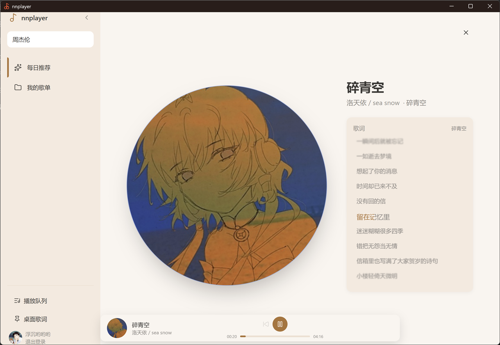
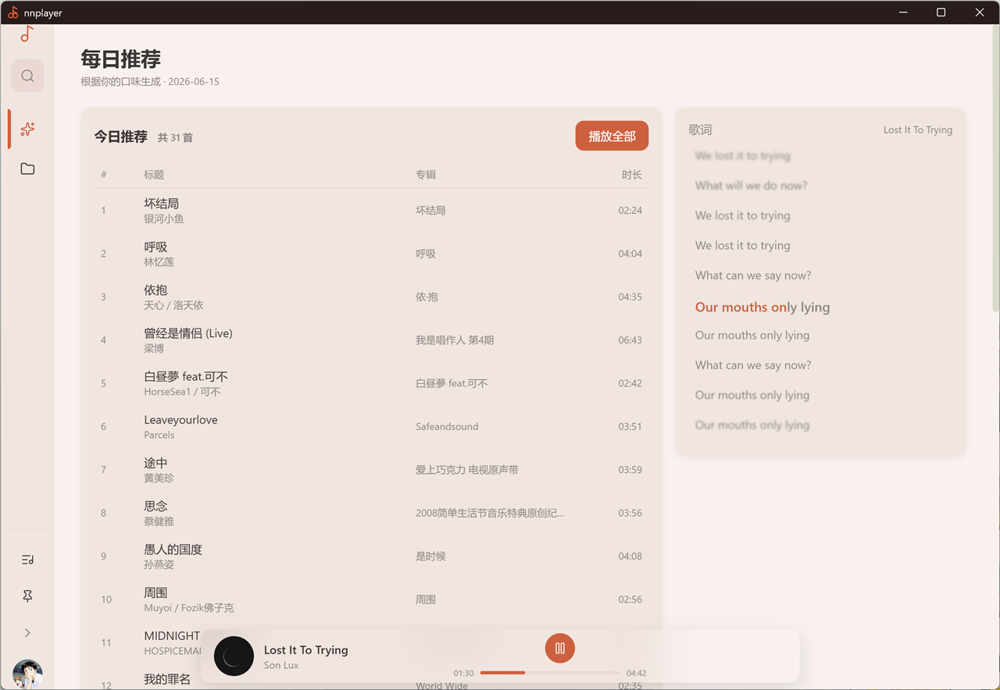
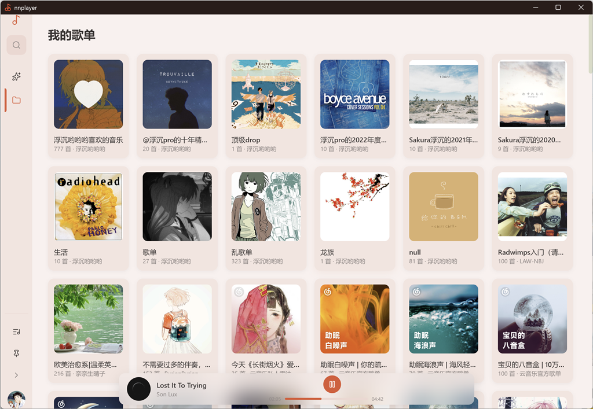
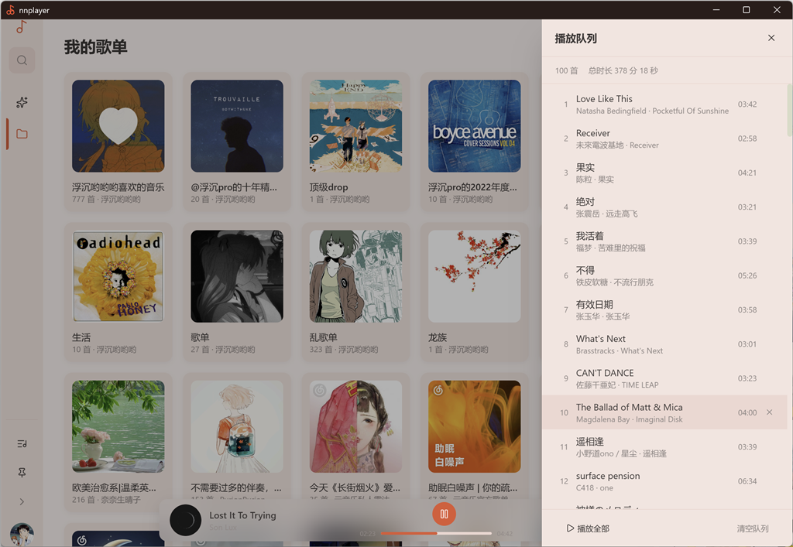
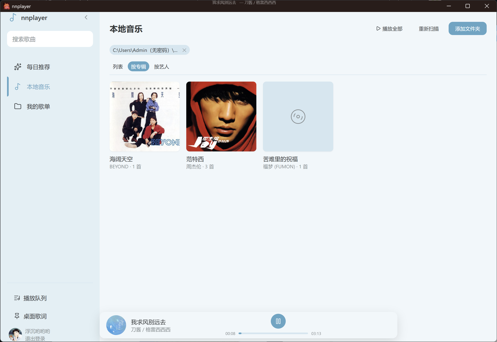
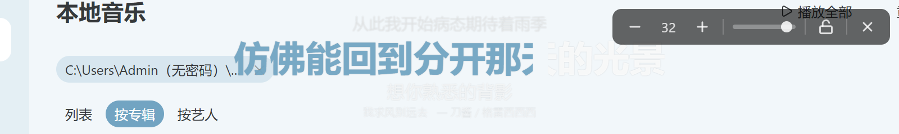

# nnplayer(纯网易云版本已移动至V0.1分支)

> 基于 **Tauri v2 + Rust + Vue 3 + TypeScript** 的网易云音乐桌面客户端。
> Rust 端通过本地 crate `ncm-api-rs` 调用网易云 API,前端用 `@tauri-apps/api` 通过 `invoke` 桥接。
> 主题色由当前播放的封面自动抽取(柔和米黄 / 暖橘红 accent 体系)。



## 预览

| 每日推荐 + 歌词面板 | 我的歌单(网格) | 播放队列抽屉 |
| --- | --- | --- |
|  |  |  |

| 本地音乐库(专辑视图) | 桌面歌词独立窗口 |
| --- | --- |
|  |  |

## 特性

### 播放

- **双后端音频引擎**:NCM 在线歌曲走 HTML5 `<audio>`,本地 FLAC / MP3 / M4A 走 Rust 自研引擎(symphonia 解码 + rodio 播放)。组件层(`useAudioPlayer`)不感知差异,统一 `playSong(songId, song)` 入口
- **本地引擎位置跟踪**:用 `Instant` 时钟(`play_offset + (now - play_started_at)`),规避 rodio 0.22 在自定义 source 上 `get_pos()` 被 audio buffer 拖累的精度问题;`seek` 走 `play(path, time)` 重建 source
- **三层状态兜底**:`audio:tick` 事件 + 200ms `getAudioState()` 轮询 + Vue watch 失效兜底;`seekingInProgress` 标志防 seek 期间 bridge.state 旧值回拉 UI 闪烁
- **WebView 刷新恢复**:Tauri 刷新 = Vue/Pinia/`<audio>` 重建,但 Rust 引擎是进程级独立组件,`restoreIfPlaying()` 拉真实状态对齐,**不调 playLocal**(避免位置重置)
- **MediaSession 桥接**:切歌时 `mediaSession.metadata` 同步,系统媒体键(play/pause/seekto/prev/next)→ window CustomEvent → Pinia store

### 网易云 / 在线

- **三种登录方式**:网易云 App 扫码(QR 码 PNG 后端生成 base64) / 账号密码 / 手机验证码(60s 倒计时);会话**双份持久化**:`tauri-plugin-store` 写 `auth.json` + `directories` 写 `session.toml`
- **每日推荐 / 我的歌单 / 搜索 / 歌单详情**:鉴权接口 + 骨架屏加载 + 搜索建议 500ms 防抖 + cloudsearch 搜索
- **YRC 逐字卡拉 OK 歌词**:解析 `[行偏移,行时长](字偏移,字时长,音量)字`(字偏移是绝对时间戳,不是相对行偏移);主窗 + 桌面歌词窗均带弹簧物理滚动(Verlet 积分)+ 行间距离模糊
- **封面主色自动提取**:0 依赖 HSL 桶分频次,改写 6 个 `--color-*` CSS 变量,推送到桌面歌词窗同步 accent

### 本地音乐库

- **扫描**:递归 `walkdir` 按 `SUPPORTED_EXTENSIONS` 过滤,`lofty` 读 tag(title/artist/album/duration/bitrate/sample_rate + has_cover),写入 Pinia `useLocalLibraryStore`
- **三种视图**:列表 / 按专辑 / 按艺人;专辑走复合 key `${name}||${artist}` 避免"不同艺人同名专辑"误合并
- **专辑 / 艺人详情页**:`/local-album/:name?artist=<artist>`(query artist 用于消歧)、`/local-artist/:name`
- **本地封面**:`getLocalCover(path)` invoke → lofty 读 tag → `image` crate 缩放 512×512 JPEG,前端 `useLocalCover` 全局缓存 path→blob URL(多歌共享,同专辑所有歌走同一 entry);三个本地视图通过 `useCoverLoader` 限流并发 8 懒加载
- **本地歌词**:内嵌 USLT / ©lyr / LYRICS → 同目录 `.lrc/.yrc/.qrc/.krc` → NCM 在线兜底;用了 NCM 在线歌词时,LyricPanel 提示"时间轴可能与本地歌曲不完全同步,可放置同名 .lrc 文件覆盖"
- **断点续播**:本地歌曲持久化到 `localStorage["nnplayer.currentLocalSong"]`,WebView 刷新后 `restoreIfPlaying` 对齐 Rust 状态

### 桌面集成

- **浮层播放器**:720px 居中浮层 64px 高,`bg-card/85 backdrop-blur-xl` 玻璃感(WebView2 模糊)
- **桌面歌词独立窗口**:透明背景 + always-on-top + CSS 变量驱动字号/不透明度/颜色,字号 ±/不透明度滑块/锁定/关闭 hover 工具条,双击切换锁定,5px 阈值拖拽
- **桌面歌词窗 IPC**:主窗 ↔ 子窗 `desktop-lyrics:control` / `apply-prefs` / `request-snapshot` 握手,几何信息防抖持久化(`useWindowGeometry`),启动前 `is_position_on_screen` 边界校验(防拔副屏后窗口消失)
- **托盘**:5 项菜单(播放/暂停、上一首、下一首、桌面歌词、退出),单击切显隐
- **全局快捷键**:`Ctrl+Alt+P`(播放/暂停) / `Ctrl+Alt+←/→`(上下首) / `Ctrl+Alt+L`(桌面歌词);Rust 端 emit 事件,前端 listen 后调 store
- **窗口位置/大小**: `tauri-plugin-window-state` 自动持久化(排除 `desktop-lyrics`,子窗走 `useWindowGeometry` 自管)

## 技术栈

| 层 | 选型 |
| --- | --- |
| 桌面壳 | Tauri v2 (`default-features = false`, `wry` + `tray-icon` + `image-png`) |
| 后端 | Rust 2021 edition,`tokio` 异步,`serde_json` 抽 NCM 响应 |
| NCM API | 本地 crate `../ncm-api-rs`(处理 weapi/eapi 加密 + Set-Cookie 捕获) |
| 本地音频 | `symphonia` 0.6(解码,`all-codecs/all-formats`)+ `rodio` 0.22(播放,`playback`) |
| 本地元数据 | `lofty` 0.24 + `walkdir` 2 |
| 前端 | Vue 3.5 + TypeScript 5.6 + Pinia 2 + Vue Router 4 + Vite 5 |
| 样式 | Tailwind 3.4(CSS 变量驱动主题色,`tailwind.config.js` 不写 hex) |
| 图标 | lucide-vue-next |
| 构建 | `vue-tsc` 类型检查 + `vite build` 前端,`cargo build --release` Rust |

## 开发

### 环境

- Node.js ≥ 18
- Rust stable(2021 edition)
- Windows 11 + WebView2(其他平台未测试,代码里 tray 用了 `tauri::tray`)

### 安装与运行

```bash
npm install                # 安装前端依赖
npm run tauri dev          # 一条命令起: Vite dev server + Cargo 编译 + Tauri 窗口
                           # 前端 HMR 在 1420/1421,Rust 改动自动重编译
```

只跑前端不开窗口(便于快速改 UI):

```bash
npm run dev                # 监听 http://localhost:1420
```

只检查 Rust 类型(不重链接):

```bash
cd src-tauri
cargo check
cargo clippy               # 推荐:写完逻辑跑一次
```

### 构建发布

```bash
npm run build              # vue-tsc 类型检查 + vite 打到 dist/
npm run tauri build        # 全套: 前端构建 + cargo build --release + NSIS 安装包
                           # 产物在 src-tauri/target/release/bundle/nsis/
```

> **NSIS 跨盘问题**: NSIS bundler 把文件解压到 `%TEMP%` 再 MoveFile 到 D 盘,Win11
> 偶尔会报 `os error 17`。**绕过办法**: 复制 `src-tauri/target/release/nnplayer.exe` 单文件分发,免安装。

## 架构

```
┌──────────────────────────────────────────────────────────┐
│  Webview (Chromium / WebView2) — 主窗                     │
│  ┌─────────────┐  ┌─────────────┐  ┌──────────────────┐  │
│  │ Vue 视图层   │  │ Pinia Store │  │ Composables      │  │
│  │ views/      │  │ user/player │  │ useNcmApi (invoke│  │
│  │ components/ │  │ /theme/     │  │ useAudioPlayer   │  │
│  │             │  │ desktopLyri-│  │  ├─ <audio> (NCM)│  │
│  │             │  │ cs/localLi- │  │  └─ Rust 引擎     │  │
│  │             │  │ brary       │  │ useAudioBridge   │  │
│  │             │  │             │  │ useLyric (单例)  │  │
│  │             │  │             │  │ useSpringScroll  │  │
│  │             │  │             │  │ useLocalCover    │  │
│  │             │  │             │  │ useCoverLoader   │  │
│  └─────────────┘  └─────────────┘  └────────┬─────────┘  │
└──────────────────────┬──────────────────────┬────────────┘
                       │ invoke('xxx')        │ IPC
┌──────────────────────┴──────────────────────┴────────────┐
│  Rust (tauri::Builder)                                   │
│  ┌─────────────────────────────────────────────────────┐ │
│  │ commands/* (auth, music, user, lyric, local_music,  │ │
│  │            audio, window_geom)                      │ │
│  │  - 抽 ApiResponse.body → 精简 DTO (camelCase)       │ │
│  │  - 全 #[tauri::command] 返回 AppResult<T>           │ │
│  └────────────────────────────┬────────────────────────┘ │
│  ┌────────────────────────────┴────────────────────────┐ │
│  │ AppState (Arc<Mutex>): ApiClient + AuthState        │ │
│  │ AudioEngine (Mutex, 独立 manage)                    │ │
│  │   ├─ symphonia 解码 + rodio 播放                    │ │
│  │   ├─ Instant 时钟位置跟踪                          │ │
│  │   └─ eof_monitor mpsc channel → emit audio:tick    │ │
│  └────────────────────────────┬────────────────────────┘ │
│  ┌────────────────────────────┴────────────────────────┐ │
│  │ ncm-api-rs (本地 crate, ../ncm-api-rs)              │ │
│  │  weapi/eapi 加密 · 设备指纹 · Set-Cookie 合并       │ │
│  └─────────────────────────────────────────────────────┘ │
│  ┌─────────────────────────────────────────────────────┐ │
│  │ 桌面歌词子窗(独立 WebView, 独立 Pinia store)        │ │
│  │   - listen 主窗 IPC: desktop-lyrics:control/apply-  │ │
│  │     prefs, mount 时 emit request-snapshot 拿首帧   │ │
│  │   - 几何信息走 useWindowGeometry 防抖持久化         │ │
│  └─────────────────────────────────────────────────────┘ │
└──────────────────────────────────────────────────────────┘
```

### 关键模块对应

| 想做的事 | 改这里 |
| --- | --- |
| 新增 Tauri command | `src-tauri/src/commands/*.rs` + `lib.rs` 全路径注册 + `composables/useNcmApi.ts::Commands` + `types/music.d.ts` |
| 改本地音频引擎 | `src-tauri/src/audio/engine.rs`(symphonia Source + rodio Player) + `state.rs`(InternalState) + `commands/audio.rs` |
| 改本地音乐扫描 | `src-tauri/src/commands/local_music.rs` + `stores/localLibrary.ts` |
| 改桌面歌词窗交互 | `src/views/DesktopLyrics.vue` + `composables/useDesktopLyricsBridge.ts` + `useLyricWindowPrefs.ts` + `useWindowGeometry.ts` |
| 新增页面 | `src/views/*.vue`,在 `router/index.ts` 加路由 |
| 新增 UI 组件 | `src/components/*.vue`,`<script setup>` 风格 |
| 改主题色规则 | `utils/colorExtractor.ts` + `stores/theme.ts` |
| 改歌词解析 | `utils/lrcParser.ts`(纯函数,YRC 逐字逻辑见 `parseYrc`),展示改 `components/LyricPanel.vue` |
| 改 NCM 响应字段 | `src-tauri/src/models.rs`(DTO) + `types/music.d.ts` |

## 目录

```
nnplayer/
├── src/                          # 前端
│   ├── views/                    # 路由级页面(含 LocalMusic/LocalAlbum/LocalArtist)
│   ├── components/               # 通用 UI 组件(LyricPanel/PlayerBarFloating/...)
│   ├── stores/                   # Pinia (user/player/theme/desktopLyrics/localLibrary)
│   ├── composables/              # useNcmApi / useAudioPlayer / useLyric / useAudioBridge
│   │                             #   useLocalCover / useCoverLoader / useDesktopLyricsBridge
│   │                             #   useLyricWindowPrefs / useWindowGeometry / useSpringScroll
│   ├── utils/                    # crypto / lrcParser / colorExtractor / localSong / format
│   ├── types/music.d.ts          # Rust→前端的 DTO 契约
│   └── router/                   # hash 路由 + 登录守卫(/desktop-lyrics 跳过登录)
├── src-tauri/                    # Rust 后端
│   ├── src/audio/                # ★ 本地音频引擎 (symphonia + rodio)
│   ├── src/commands/             # auth / music / user / lyric / local_music / audio / window_geom
│   ├── src/models.rs             # 精简 DTO
│   ├── src/state.rs              # AppState
│   ├── src/error.rs              # AppError 枚举 + map_ncm_err
│   └── capabilities/             # 窗口权限
├── ncm-api-rs/                   # 网易云 API 本地 crate
├── vendor/brotli/                # 绕开 brotli 8.0.3 nightly 编译错误([patch.crates-io])
├── screenshots/                  # README 用图(本目录)
├── docs/                         # 设计文档(本地,gitignored)
└── app-icon.svg                  # 应用图标源文件
```

## 数据持久化位置

- 会话: `%APPDATA%\nnplayer\auth\session.toml` (Windows) + `tauri-plugin-store` 的 `auth.json`
- 音量/侧栏折叠: `localStorage` (`nnplayer.volume` / `nnplayer.sidebarCollapsed`)
- 本地音乐扫描目录: `localStorage["nnplayer.localFolders"]` (JSON 数组)
- 当前本地歌曲(用于 WebView 刷新恢复): `localStorage["nnplayer.currentLocalSong"]` (JSON,含 id/name/artists/album/localPath)
- 桌面歌词窗本地偏好(字号/不透明度/锁定/颜色): `localStorage["nnplayer.lyricWindow.prefs"]`(仅子窗;跨窗不能直接读主窗 localStorage)
- 窗口位置/大小/最大化: `tauri-plugin-window-state` 自动管理(主窗;`desktop-lyrics` 子窗走 IPC 让主窗代写)

## 调试

- Rust 日志通过 `env_logger`,前缀 `[startup]` / `[login_qr_key]` / `[login]`
- 前端没有日志库,关键警告走 `console.warn`
- 类型检查: `vue-tsc --noEmit`(零警告通过,`npm run build` 会自动跑)
- 本地音频引擎位置不准时:查 `audio/state.rs::InternalState` 的 `play_offset` / `play_started_at` 时钟连贯性,`play/pause/resume` 都要更新这两个字段

## 已知限制

- **平台**: 仅在 Windows 11 + WebView2 测试,macOS / Linux 理论上可跑但托盘/快捷键/打包需适配
- **会员内容**: `get_song_url` 走 320kbps 优先,VIP 灰歌曲能拿到 URL 但部分专辑需登录态,本项目三种登录都支持
- **打包**: NSIS 在跨盘 `%TEMP%` 时会失败,生产建议用单 exe 模式或修 `tauri.conf.json` 改 `bundle.targets` / 自定义 NSIS 路径
- **本地音频格式**: `symphonia` `all-codecs`/`all-formats` 启用后理论支持所有主流格式;罕见容器(如 WMA)解码异常属上游 issue
- **桌面歌词窗位置恢复**: 启动前用 `is_position_on_screen` 边界校验(防拔副屏后窗口消失在不可见坐标),校验失败时回落到主屏中心

## 致谢

- 网易云音乐 (NCM) — 唯一 API 源
- [ncm-api-rs](./ncm-api-rs) — 本仓库同级的 Rust NCM 客户端
- [Tauri](https://tauri.app) / [Vue](https://vuejs.org) / [Pinia](https://pinia.vuejs.org) / [Tailwind CSS](https://tailwindcss.com) / [lucide](https://lucide.dev)
- [symphonia](https://github.com/pdeljanov/Symphonia) / [rodio](https://github.com/RustAudio/rodio) / [lofty](https://github.com/Serial-ATA/lofty-rs) — 本地音频栈

## License

本仓库未声明开源协议,**默认保留所有权利**。NCM API 的使用需遵守 [网易云音乐服务条款](https://music.163.com/)。
