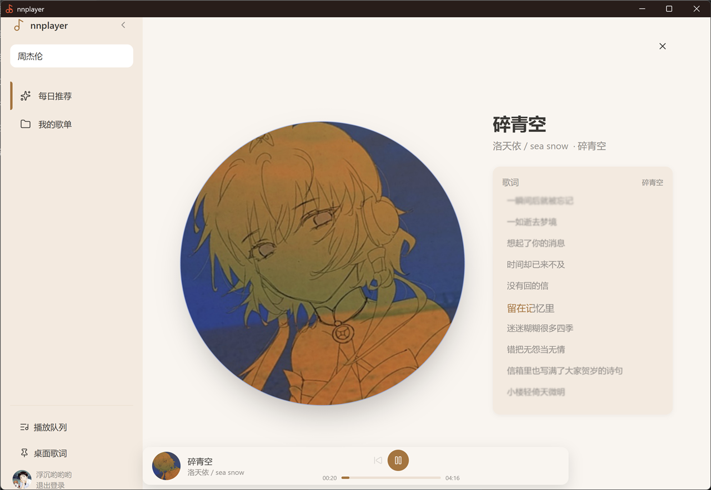
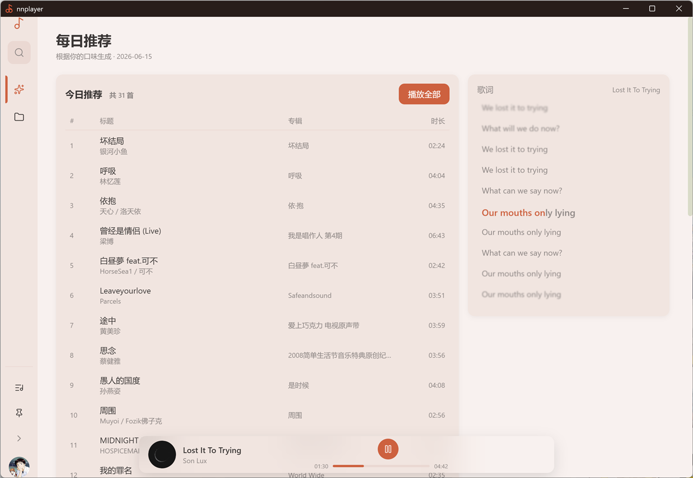
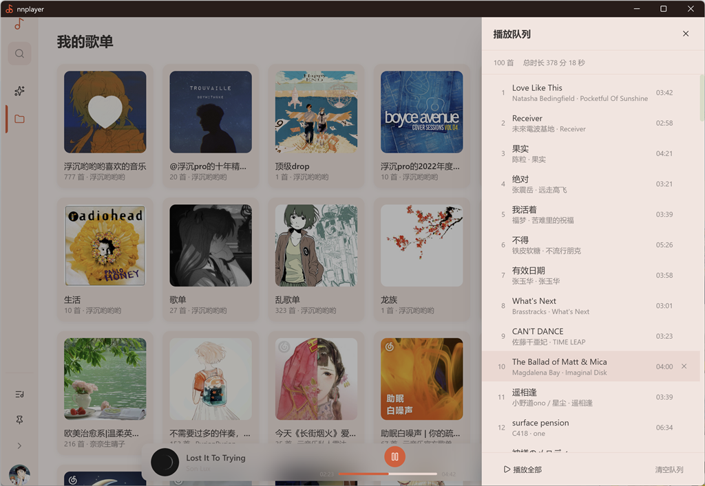

<div align="center">


# nnplayer

一个使用 Tauri v2、Rust、Vue 3 与 TypeScript 构建的网易云音乐桌面播放器。

[下载最新版](https://github.com/3274375092/nnplayer/releases/latest) · [提交问题](https://github.com/3274375092/nnplayer/issues)


[](https://dsh.directory/plugins/3274375092/dsh-voice)

</div>

> [!IMPORTANT]
> nnplayer 是非官方第三方客户端，与网易云音乐及其关联公司无关。项目仅供学习与个人使用，请遵守所在地法律法规及网易云音乐服务条款。



## 功能

- 每日推荐、歌曲搜索、搜索建议、个人歌单与歌单详情
- 扫码、账号密码、手机验证码三种登录方式，并提供高级 Cookie 登录入口
- 播放队列、进度跳转、音量控制、列表循环、单曲循环与随机播放
- 系统媒体键、托盘菜单和全局快捷键控制；关闭主窗口后继续驻留托盘
- LRC 行级歌词、YRC 逐字卡拉 OK、翻译歌词与基于音频时钟的精确同步
- 主界面长歌词自动换行；桌面歌词长行自动缩放，不产生横向滚动条
- 独立透明桌面歌词窗口，支持置顶、拖动、锁定、字号和不透明度调节
- 默认采用 Gruvbox Light；播放歌曲时根据封面调色板派生浅色背景、环境辅助色与主题色
- 请求去重与有界缓存、歌曲地址预取、长列表虚拟化和按显示尺寸加载封面
- 登录会话隔离：切换账号或退出时清理旧请求、缓存与媒体源

## 界面预览

| 每日推荐 | 我的歌单 | 播放队列 |
| --- | --- | --- |
|  |  |  |

## 快捷键

| 快捷键 | 功能 |
| --- | --- |
| `Ctrl + Alt + P` | 播放 / 暂停 |
| `Ctrl + Alt + ←` | 上一首 |
| `Ctrl + Alt + →` | 下一首 |
| `Ctrl + Alt + L` | 显示 / 隐藏桌面歌词 |

## 下载与使用

当前发布流程支持 Windows x86_64 与 Linux x86_64（Debian/Ubuntu `.deb`、AppImage）。Linux 运行需要 GTK/WebKitGTK 4.1 及系统托盘支持；不同发行版的依赖名称可能略有差异。

1. 前往 [Releases](https://github.com/3274375092/nnplayer/releases/latest) 下载 Windows 安装包，或 Linux 的 `.deb` / `AppImage`。
2. Linux 可执行 `chmod +x nnplayer*.AppImage` 后直接启动；Debian/Ubuntu 可使用 `sudo apt install ./nnplayer*.deb`。
3. 使用网易云音乐 App 扫码，或通过账号、手机验证码登录。

部分歌曲是否能够播放由账号权限、版权区域和网易云音乐接口状态决定。

## 本地开发

### 环境要求

- Node.js 20 LTS
- Rust stable
- Windows 下的 Tauri 开发依赖：WebView2、Microsoft C++ Build Tools
- Linux 下的 Tauri 开发依赖：`libwebkit2gtk-4.1-dev libappindicator3-dev librsvg2-dev patchelf`

完整系统依赖请参考 [Tauri prerequisites](https://v2.tauri.app/start/prerequisites/)。

### 启动项目

```powershell
git clone https://github.com/3274375092/nnplayer.git
cd nnplayer
npm ci
npm run tauri dev
```

`ncm-api-rs` 通过 Cargo 路径依赖直接编译进应用，正常开发和运行 nnplayer 不需要额外启动 API 服务。

只调试前端界面时可以运行：

```powershell
npm run dev
```

该命令只启动 Vite；登录、播放等依赖 Tauri `invoke` 的功能需要在完整桌面环境中调试。

### 检查与测试

```powershell
# TypeScript 类型检查与前端生产构建
npm run build

# 歌词解析、对齐和时间轴回归测试
npm run test:lyrics

# Rust 检查
cargo check --manifest-path src-tauri/Cargo.toml

# Rust 格式检查
cargo fmt --manifest-path src-tauri/Cargo.toml --all -- --check
```

### 构建安装包

```powershell
npm run tauri build
```

Windows 安装包默认输出到 `src-tauri/target/release/bundle/nsis/`。

## 架构

```text
Vue 3 视图与组件
        │
        ├── Pinia：用户、播放队列、主题、桌面歌词窗口状态
        ├── Composables：音频、歌词时间轴、查询缓存、跨窗口同步
        │
        ▼ invoke / events
Tauri v2 命令层（Rust）
        │
        ├── 登录会话与本地持久化
        ├── DTO 转换与错误分类
        └── 托盘、全局快捷键、窗口生命周期
        │
        ▼
ncm-api-rs（本地 Rust crate）
        │
        ├── weapi / eapi 请求与加密
        ├── Cookie 和设备信息处理
        └── 网易云音乐接口调用
```

播放与歌词使用同一个权威媒体时钟。主歌词面板按需逐帧更新；桌面歌词窗口接收完整时间轴快照和轻量时钟锚点，在窗口内计算当前行与逐字进度，减少跨窗口通信开销。

## 目录结构

```text
nnplayer/
├── src/                    # Vue 前端
│   ├── components/         # 播放栏、歌词、歌曲列表、侧边栏等组件
│   ├── composables/        # 音频、歌词、缓存与窗口桥接逻辑
│   ├── services/           # 认证会话边界
│   ├── stores/             # Pinia 状态
│   ├── utils/              # 歌词解析、时间轴、主题色等工具
│   └── views/              # 页面与桌面歌词窗口
├── src-tauri/              # Tauri 后端、命令、托盘和打包配置
├── ncm-api-rs/             # 内嵌网易云音乐 Rust API crate
├── tests/                  # 歌词解析与对齐回归测试
├── screenshots/            # README 截图
└── .github/workflows/      # CI 与 Windows 发布流程
```

## ncm-api-rs

应用通过 `src-tauri/Cargo.toml` 中的本地路径依赖直接使用 `ncm-api-rs`。该 crate 也提供可选的 Axum HTTP 服务，适合单独调试 API；它不是 nnplayer 的运行前置条件。

```powershell
$env:NCM_HOST = "127.0.0.1"
cargo run --manifest-path ncm-api-rs/Cargo.toml --features server --bin ncm-server
```

服务本身默认监听 `0.0.0.0:3000`。上面的本地调试示例显式绑定回环地址；未配置鉴权和访问控制时，请勿将服务直接暴露到公网。

支持的环境变量如下：

| 变量 | 说明 | 默认值 |
| --- | --- | --- |
| `NCM_HOST` | 监听地址 | `0.0.0.0` |
| `NCM_PORT` | 监听端口 | `3000` |
| `CORS_ALLOW_ORIGIN` | 允许的 CORS Origin | 允许全部 |
| `RATE_LIMIT` | 时间窗口内的最大请求数，`0` 表示关闭 | `0` |
| `RATE_LIMIT_WINDOW` | 限流时间窗口，单位为秒 | `60` |
| `RUST_LOG` | Rust 日志过滤规则 | `ncm_api=info` |

## 技术栈

| 领域 | 技术 |
| --- | --- |
| 桌面运行时 | Tauri v2、Wry、WebView2 |
| 前端 | Vue 3、TypeScript、Pinia、Vue Router、Vite |
| 样式与图标 | Tailwind CSS、Lucide |
| Rust | Tokio、Serde、Reqwest、Rustls |
| NCM 接口 | 仓库内的 `ncm-api-rs` |

## 致谢

- [`imsyy/ncm-api-rs`](https://github.com/imsyy/ncm-api-rs)：仓库内 Rust NCM 客户端的上游项目
- [Tauri](https://tauri.app/)、[Vue](https://vuejs.org/)、[Pinia](https://pinia.vuejs.org/)、[Tailwind CSS](https://tailwindcss.com/)、[Lucide](https://lucide.dev/)

## Fedora 安装

Release 同时提供 Fedora/RHEL 系列使用的 RPM 包：

```bash
sudo dnf install ./nnplayer-*.x86_64.rpm
```

如果依赖未自动安装：

```bash
sudo dnf install webkit2gtk4.1 libappindicator-gtk3 librsvg2
```

也可以使用同一 Release 中的 AppImage。GNOME Wayland 用户如需系统托盘，请启用 AppIndicator 扩展。

## 许可

nnplayer 主项目采用 [MIT License](./LICENSE)。`ncm-api-rs` 在其 Cargo 清单中声明为 WTFPL，请同时遵循第三方依赖各自的许可条款。
